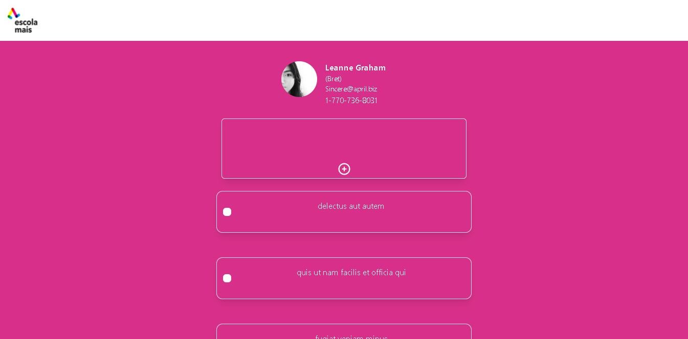

<h1>Front-end Challenge EM</h1>

<h3>Tecnologias usadas</h3>
<ul>
    <li>
        Next.js
        <ul>
            <li>
                Renderização no servidor - Server Side Rendering - SSR
            </li>
            <li>
                Import Dinâmico
            </li>
            <li>
                Otimização de imagens
            </li>
            <li>
                Otimização aprimorada para mecanismos de pesquisa de forma fácil (SEO)
            </li>
            <li>
                Usabilidade imediata de rotas
            </li>
        </ul>
    </li>
    <li>
        Tailwind
        <ul>
            <li>
                Desenvolvimento mais rápido de componentes
            </li>
            <li>
                Tamanho consistente dos arquivos .css
            </li>
            <li>
                Não precisa nomear classes 🙏
            </li>
        </ul>
    </li>
</ul>

<br>
<br>

<h1>Execute localmente</h1>

```bash
git clone https://github.com/YuriCorredor/front-end-challenge-escolamais.git
cd front-end-challenge-escolamais
# instale as dependências
npm install
```

<br>

<p>Agora basta executar o servidor local.</p>

```bash
npm run dev
# ou
yarn dev
```

<br>
<br>

<h1>Visão geral do aplicativo</h1>

Visite o site [AQUI](https://front-end-challenge-escolamais.vercel.app/).


 